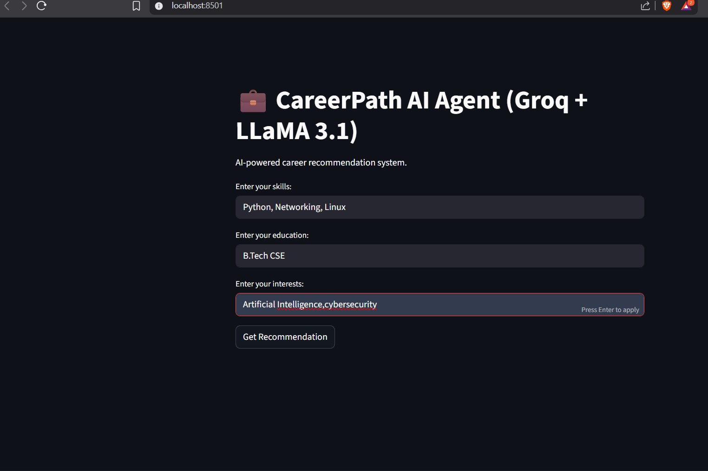

# Career Path AI Agent 🤖🎓

An interactive, GenAI-powered dashboard that acts as an intelligent career counselor. Built using Streamlit and the Groq API (Llama-3).

## 📌 Project Overview
Deciding on a career path is a high-stakes challenge for students. This application serves as a customized advisor. Users supply their academic background, interests, and programming familiarity, and the LLM agent returns structured recommendations detailing learning pathways, certifications, and target job titles.

## 📱 Application Preview
Here is a preview of the interactive dashboard:



## 🛠️ Tech Stack
- **Web App Interface:** Streamlit (Python-based UI)
- **Large Language Model:** Llama-3-70B via the Groq API
- **API Orchestration:** Groq SDK, Python requests
- **Prompt Engineering:** Few-shot prompting, structured JSON schema outputs

## ⚙️ Key Features
- **Prompt Engineering Templates:** Implements system prompts and few-shot formatting instructions to guarantee structured responses.
- **JSON Output Constraints:** Ensures the Groq API returns clean, parsable JSON matching schemas for reliable front-end rendering.
- **Client-Side Validation:** Validates empty queries, filters malicious inputs, and executes fallback behaviors for API timeout exceptions.
- **Interactive UI:** A highly responsive Streamlit dashboard presenting step-by-step career path roadmaps.

## 🚀 How to Run Locally

1. Clone the repository:
   ```bash
   git clone https://github.com/Enaganti2349/career-path-ai-agent.git
   cd career-path-ai-agent
   ```

2. Install dependencies:
   ```bash
   pip install -r requirements.txt
   ```

3. Set up your environment variables:
   Create a `.env` file in the root directory and add your Groq API key:
   ```env
   GROQ_API_KEY="your_actual_groq_api_key"
   ```

4. Run the Streamlit server:
   ```bash
   streamlit run app.py
   ```
